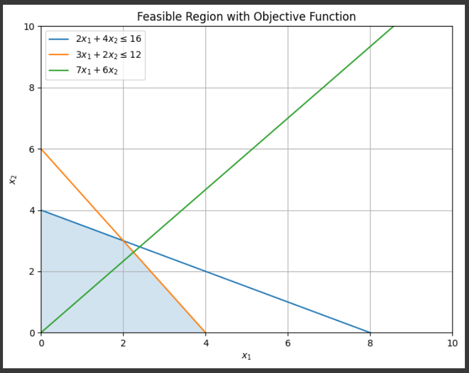
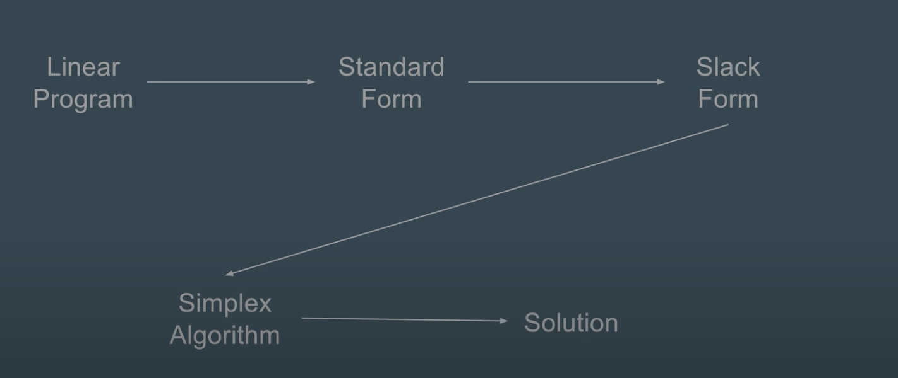
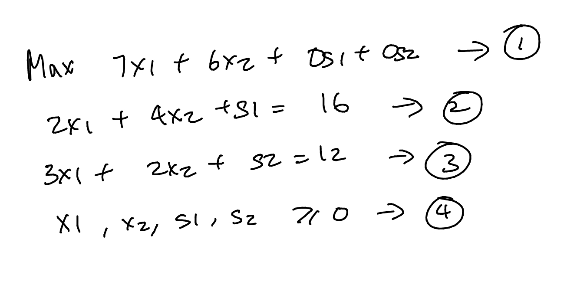
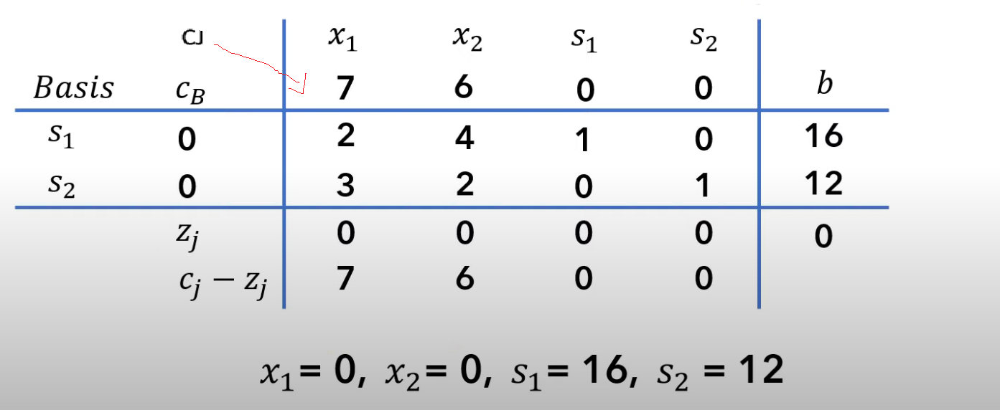
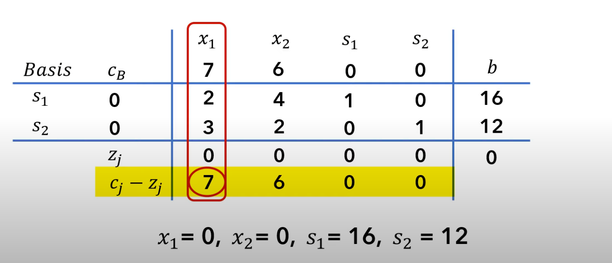
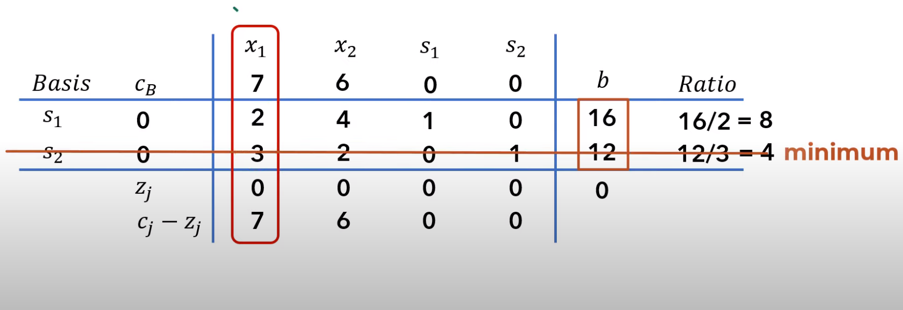
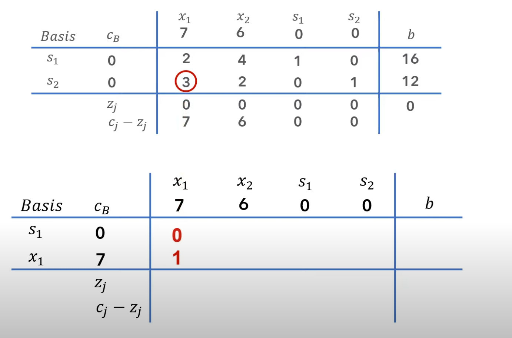
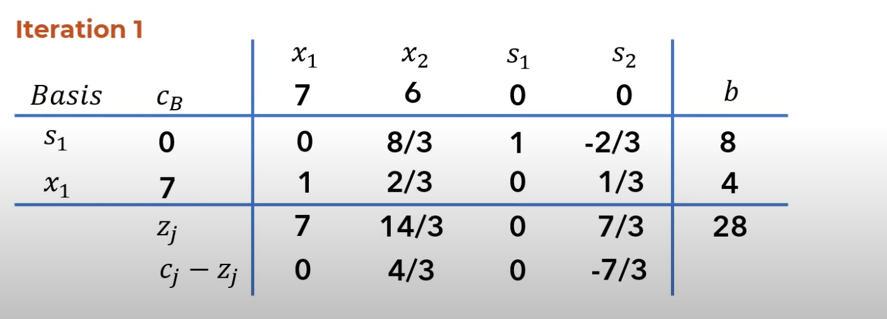
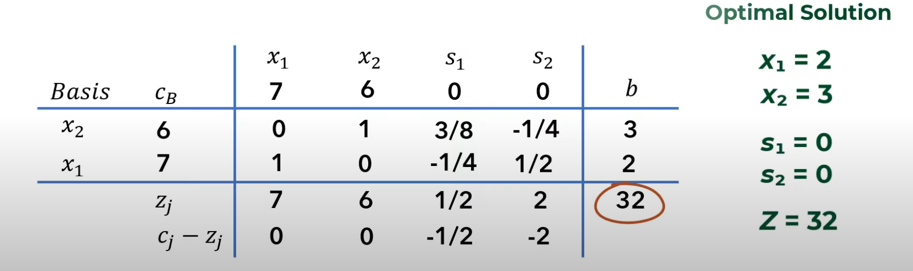

## Linear Programming
- Linear programming is a mathematical **optimization technique** used to find the best possible solution to a problem where the objective and constraints are expressed as linear relationships. It's commonly used in various fields such as economics, operations research, engineering, and management to make decisions in resource allocation, production planning, and other similar scenarios.
- In linear programming, you have an objective function that you want to either **maximize or minimize**. This function is a linear combination of variables, each multiplied by a coefficient, and the goal is to adjust these variables within certain bounds to achieve the optimal outcome. Additionally, there are constraints that restrict the values of these variables based on various limitations. These constraints are also expressed as linear inequalities or equalities.
- The main idea is to find the values of the variables that satisfy all the constraints while simultaneously optimizing the objective function. This is typically done using mathematical algorithms that explore the feasible region and identify the point within this region where the objective function reaches its optimal value.

## Simplex Algorithm
- The Simplex algorithm is a widely used method for solving linear programming problems. It's an **iterative algorithm** that starts from an initial feasible solution and systematically moves towards the optimal solution by traversing the vertices of the feasible region.

Let's consider <br>
**Objective Function:** <br>
**Max 7x1 + 6x2** <br>


**Constraints:** <br>
- 2x1 + 4x2 <=16 <br>
- 3x1 + 2x2 <= 12 <br>
- x1, x2 >=0 <br>



- All feasible solutions lie within the gray shaded area, which represents the region where all given constraints are satisfied.
- This area is encapsulated by the [convex hull](https://en.wikipedia.org/wiki/Convex_hull), a minimal convex polygon connecting the extreme points of the feasible region. In the context of the simplex algorithm, the vertices of this convex hull correspond to unique combinations of variables that fulfill the constraints.
- The simplex algorithm optimizes the objective function by iteratively moving between these vertices while maintaining feasibility.

**Reference code**
``` Python
import numpy as np
import matplotlib.pyplot as plt

c = np.array([7, 6])

A = np.array([[2, 4], [3, 2]])
b = np.array([16, 12])

x1_range = np.linspace(0, 10, 400)
x2_range = np.linspace(0, 10, 400)
X1, X2 = np.meshgrid(x1_range, x2_range)

plt.figure(figsize=(8, 6))
plt.plot(x1_range, (16 - 2*x1_range) / 4, label=r'$2x_1 + 4x_2 \leq 16$')
plt.plot(x1_range, (12 - 3*x1_range) / 2, label=r'$3x_1 + 2x_2 \leq 12$')

plt.fill_between(x1_range, np.minimum((16 - 2*x1_range) / 4, (12 - 3*x1_range) / 2), 0, alpha=0.2)

# Plot the objective function line
plt.plot(x1_range, (c[0] * x1_range + c[1] * 0) / c[1], label=r'$7x_1 + 6x_2$')

plt.xlabel(r'$x_1$')
plt.ylabel(r'$x_2$')
plt.title('Feasible Region with Objective Function')
plt.legend()
plt.grid()

plt.xlim(0, 10)
plt.ylim(0, 10)
plt.show()
```

The general steps on how to solve a Linear Programming goes like this
1. **Linear Program Conversion:** When dealing with a linear programming problem, the initial step involves transforming it into the standard form. This entails converting any inequalities into equalities and expressing the objective function in a standard way.
2. **Standard Form and Slack Variables:** The linear program, now in standard form, incorporates slack variables to convert inequality constraints into equations. This results in a system of linear equations that comprehensively defines the feasible region.
3. **Application of Simplex Algorithm:** The simplex algorithm is then employed to iteratively navigate the feasible region by pivoting between basic variables and non-basic variables. This iterative process aims to optimize the objective function while adhering to the constraints.
4. **Attaining a Solution:** Through successive iterations, the simplex algorithm eventually converges to an optimal solution. This solution corresponds to the values of the variables that maximize or minimize the objective function while satisfying all the constraints of the linear program.



## Step 1: Converting Linear Program to Standard Form
1. **Maximize the Objective Function:** All standard form linear programming problems are maximization problems. If initially a minimization problem, multiply the objective function by -1 to convert it into a maximization problem.
2. **Ensure Non-Negative Variables:** The standard form requires that all decision variables must be greater than or equal to zero. If any variable does not have a non-negativity constraint, add one.
3. **Convert Equality Constraints to Inequality Constraints:** Standard form prefers inequalities. If you have an equation constraint, convert it to two inequalities: one 'greater than or equal to' and another 'less than or equal to' – effectively bounding the solution space for that constraint.
4. **Ensure Correct Inequality Orientation:** The standard form requires that constraints must be in the form of (linear function <= constant). Rearrange or multiply by -1 any constraint not in this form, as required.

## Step 2: Converting Standard Form to Slack Form
1. **Adding Slack Variables:** For every inequality constraint where function <= constant, a slack variable is added to the left hand side of the inequality to convert it into an equation. The slack variables represent the “unused” resources and are added such that the equality holds.
2. **Rewriting the Objective Function:** The objective function must be isolated in the equation. This requires shifting the function to one side of the equation and setting the equation equal to zero.

**Example:** <br>
**Max 7x1 + 6x2** <br>
**Constraints:** <br>
- 2x1 + 4x2 <=16 <br>
- 3x1 + 2x2 <= 12 <br>
- x1, x2 >=0 <br>

Lets apply step 1 and step 2 to this problem <br>
The problem is now rewritten as <br>

- Max 7x1 + 6x2 + 0s1 + 0s2 <br>
- 2x1 + 4x2 + s1 = 16 <br>
- 3x1 + 2x2 + s2 = 12 <br>
- x1, x2, s1, s2 >=0 <br>


## Step 3: Simplex Algorithm
1. **Find Basic Solution:** Start by finding an initial basic feasible solution, usually by setting some variables to zero and others to values that satisfy the equality constraints.
2. **Iterate for Optimal Solution:**
    1. **Select Non-Basic Variable:** Choose a non-basic variable with a positive coefficient in the objective function. This variable has the potential to increase the objective function value.
    2. **Increase Variable Value:** Increment the selected non-basic variable as much as possible without violating any non-negativity constraints.
    3. **Identify Tightest Constraint:** Determine the tightest constraint that becomes binding (i.e., its equality is satisfied) as the chosen variable is increased. This constraint will determine the direction of movement in the feasible region.
    4. **Role Switch:** Perform a role switch between the selected non-basic variable and the variable corresponding to the identified tightest constraint. The selected non-basic variable becomes basic, and the basic variable becomes non-basic.
3. **Optimality Condition:** Continue this iteration until no further improvement is possible, and all coefficients of the objective function for non-basic variables are negative or zero.


**Lets solve the following problem using simplex algorithm step by step** <br>



> We have to set n-m variables to zero. These variables are called Non basic variables. On solving the problem for m remaining variables we get basic varibales. Here n is the number of equations (4)  and m is the number of variables (2, s1 and s2)

On setting x2 and s1 to 0 we get
- x1 = 8, x2 = 0, s1 = 0 and s2 = -12. This is called a **basic solution** but this is **infeasible** because s2 violates the constraint
- x2 and s1 are called **non basic variables**
- x1 and s2 are called **basic variables**

On setting x1 and x2 to 0 we get
- x1 = 0, x2 = 0, s1 = 16 and s2 = 12. This is now a **feasible basic solution** as all the constraints are satisfied.


**Setting up as a tableau**


where
- CB is the objective function coeffecients
- Zj is obtained by multiplying CB with corresponding column and added together. For example Zj's first value is (0* 2 + 0* 3)
- Cj - Zj is self explanatory


Now we will continue our algorithm until all the values in Cj-Zj <= 0. <br>
- To proceed with our algorithm we need to select the max value in the Cj-Zj row which is x1 and its value is 7.
- Here **x1** column is called as key or pivot column.


- In order to determine which basis variable x1 will replace we divide the b value by corresponding pivot column.
- We choose the ratio which will be minimum. Here **s2** has the min value.



- This min row (s2) is referred to as key or pivot row and the intersection of pivot column and pivot row is known as pivot element.
- Now s2 leaves the basis and its replaced by x1.
- Our objective is to make the pivot element 1 and the other values that are present in the same column as pivot element should be converted to zero.


- All the values in the row 2 is now replaced by the operation **Row 2 =  (Row 2)/3**
- All the values in the row 1 is now replaced by the operation **Row1 = Row 1 - (2 * Row 2)**
- Now we calculate the values of Zj and Cj - Zj again
- **Iteration 1 is now complete** We still have a positive value in the Cj - Zj row indicating further optimisation can be done. 



- Now repeat the same steps which we followed earlier
- By the end of 2nd iteration our tableau looks like this



- **The optimal value for Z is 32**

## Applications of Simplex algorithm in real life
1. **Supply Chain Management**: Companies often use linear programming to optimize their supply chains, considering factors like production capacities, transportation costs, and demand. The Simplex algorithm can help determine the optimal allocation of resources to minimize costs or maximize profits.
2. **Production Planning**: Manufacturing companies use linear programming to plan production schedules, considering constraints such as resource availability, production capacity, and demand variations. The Simplex algorithm can optimize these plans for efficiency and cost-effectiveness.
3. **Portfolio Optimization**: In finance, the Simplex algorithm can be applied to optimize investment portfolios. It helps allocate funds to different assets in a way that maximizes returns while considering risk constraints.
4. **Transportation and Distribution**: The algorithm is used to optimize transportation and distribution networks, helping businesses decide how to transport goods from multiple suppliers to multiple consumers while minimizing costs.
5. **Network Flow Problems**: The Simplex algorithm is employed to solve network flow problems, such as finding the maximum flow or minimum cut in networks like transportation networks, communication networks, and supply networks.
   
## Time Complexity
- The computational efficiency of the Simplex algorithm can vary based on factors such as the problem's characteristics and the algorithm's specific implementation. In certain cases, the algorithm's worst-case time complexity can be exponential, which implies that it may require a large number of iterations to solve certain types of linear programming problems. However, real-world performance often diverges from this worst-case scenario.
- To enhance the algorithm's average-case performance, pivot rules have been devised. Additionally, a two-phase method may be employed, which includes solving a preliminary linear programming problem. While the Simplex algorithm can experience exponential behavior in specific instances, it is frequently capable of effectively tackling practical problems with polynomial time complexity. This indicates that the number of iterations needed to find the optimal solution typically grows polynomially as the input size increases.

## Space Complexity 
- The space complexity of the Simplex algorithm hinges on the implementation's chosen data structures and strategies. In conventional implementations that employ a tableau-based approach, the most significant contributor to space complexity is usually the storage of the tableau itself. The tableau is a matrix that represents both the coefficients of the constraints and the present basic feasible solution.
- Given a problem with n variables and m constraints, the tableau matrix is of dimensions m × (n + m). Consequently, the space complexity can be approximated as O(mn), accounting for the storage of the tableau.

## Conclusion
The Simplex algorithm is a powerful optimization technique that efficiently solves linear programming problems by iteratively moving along the edges of a feasible region to find the optimal solution. Its advantages lie in its effectiveness for solving large-scale linear programming problems, providing a guaranteed optimal solution when feasible, and its versatility in addressing a wide array of real-world optimization challenges. However, it can struggle with highly degenerate problems, where multiple pivot choices lead to the same solution, potentially causing slow convergence. Additionally, the Simplex algorithm may not be suitable for non-linear programming problems, and certain scenarios could lead to cycling, where the algorithm repeatedly revisits the same solutions without progress. 


## 💡 Are you ready to test your knowledge?
1. What is the primary goal of the Simplex algorithm in linear programming? <br>
		a) To maximize the number of iterations <br>
		b) To find a feasible solution within a bounded region <br>
		c) To find the global optimal solution <br>
		d) To simplify the problem to a single variable <br>

<details> <summary>Click to reveal answer</summary> b) To find a feasible solution within a bounded region </details>

2. In linear programming, what is the feasible region? <br>
    a) The region where constraints are violated <br>
    b) The region where the objective function is maximized <br>
    c) The set of all possible solutions to the problem <br>
    d) The region where constraints are satisfied simultaneously <br>

<details>
   <summary>Click to reveal answer</summary>
   d) The region where constraints are satisfied simultaneously
</details>

3. Which of the following statements is true about degeneracy in the Simplex algorithm? <br> 
    a) Degeneracy is a term used for infeasible solutions <br>
    b) Degeneracy indicates the presence of multiple optimal solutions <br>
    c) Degeneracy leads to faster convergence in the algorithm <br>
    d) Degeneracy is a characteristic of non-linear programming problems <br>

<details>
   <summary>Click to reveal answer</summary>
   b) Degeneracy indicates the presence of multiple optimal solutions
</details>

4. What is the pivot element in the Simplex algorithm? <br>
    a) The element chosen to be the starting point of the algorithm <br>
    b) The element that helps move from one feasible solution to another <br>
    c) The element that is excluded from the constraints <br>
    d) The element chosen randomly during each iteration <br>

<details>
   <summary>Click to reveal answer</summary>
   b) The element that helps move from one feasible solution to another
</details>

5. In the Simplex tableau, what does the entry in the objective function row and the pivot column represent? <br>
    a) The cost coefficient of the pivot variable <br>
    b) The value of the pivot variable in the current iteration <br>
    c) The change in the objective function value by adjusting the pivot variable <br>
    d) The ratio of the objective function coefficient to the pivot column coefficient <br>

<details>
   <summary>Click to reveal answer</summary>
   c) The change in the objective function value by adjusting the pivot variable
</details>

6. When does the Simplex algorithm terminate? <br>
    a) When it reaches the maximum number of iterations <br>
    b) When an unbounded solution is encountered <br>
    c) When a feasible solution is found <br>
    d) When the optimal solution is reached <br>

<details>
   <summary>Click to reveal answer</summary>
   b) When an unbounded solution is encountered
</details>

7. What is cycling in the context of the Simplex algorithm? <br>
    a) A process of selecting pivot elements with small coefficients <br>
    b) A situation where the algorithm gets stuck in a loop without progress <br>
    c) A method to quickly find the optimal solution by skipping iterations <br>
    d) A technique to handle degeneracy in the initial tableau <br>

<details>
   <summary>Click to reveal answer</summary>
   b) A situation where the algorithm gets stuck in a loop without progress
</details>

## References
1. Simplex algorithm. (2023, August 8). In Wikipedia. https://en.wikipedia.org/wiki/Simplex_algorithm
2. Linear programming. (2023, August 10). In Wikipedia. https://en.wikipedia.org/wiki/Linear_programming
3. https://www.hec.ca/en/cams/help/topics/The_steps_of_the_simplex_algorithm.pdf
4. https://www.math.wsu.edu/students/odykhovychnyi/M201-04/Ch06_1-2_Simplex_Method.pdf
5. https://www.youtube.com/watch?v=9YKLXFqCy6E&ab_channel=JoshuaEmmanuel

